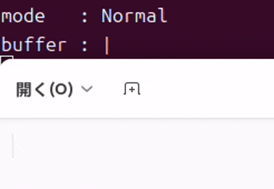

# Phantom Board

<p align="center">
  
</p>

Phantom Board is an input assistance tool for Linux.  
It allows you to take notes on the spot without switching windows and paste them later wherever you need them. Even when you want to jot down information while researching, it doesn't interrupt your work. It also supports Japanese input, making it useful for note-taking and document creation.

> **Warning:** This project is still under development and may contain bugs. Use at your own risk.

## Environment

- Ubuntu 24.04 LTS
- X11 (Wayland は未対応)
- IBus

## Quick Start

```bash
cd resources
bash daemon_setup.sh
bash daemon_build.sh
bash ui_build.sh
sudo chmod 666 /dev/input/eventX
sudo chmod 666 /dev/uinput
bash daemon_run.sh
bash ui_run.sh
```

## Usage

Phantom Board has two modes: **Normal Mode** and **Phantom Mode**.  
Toggle between them by pressing **Left Shift + Right Shift** simultaneously.

| Mode | Behavior |
|------|----------|
| Normal Mode | Input goes directly to the currently focused window |
| Phantom Mode | Input is stored in an internal buffer |

In Phantom Mode, press **Enter** to output the buffered text to the currently focused window.

<div align="center">
  
</div>

The current mode is indicated by the system tray icon: **white** = Phantom Mode, **gray** = Normal Mode.

<div align="center">
  
</div>

## Roadmap

- Bug fixes
- Package as a Debian package
- UI: add window support
- ctl: add commands to control daemon and UI

## Test

```bash
sudo hexdump /dev/input/eventX
```

## Commit Message 

I used the following prefixes for commit messages:

- `chore: ` maintenance
- `docs: ` documentation only changes
- `feat: ` new feature
- `fix: ` bug fix
- `refactor: ` code changes that don't change behavior
- `style: ` code format only changes

Example: 

`feat: add IBus IME support`
